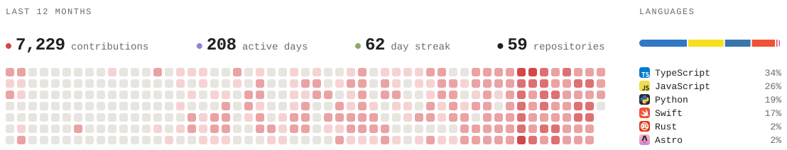
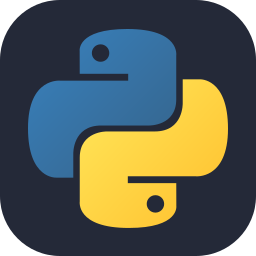
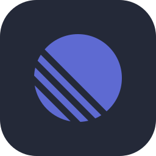
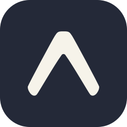
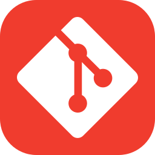
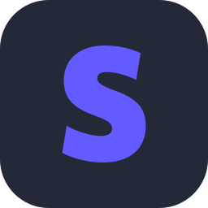

  <a href="https://caetanovincent.com/"><strong>Portfolio ↗</strong></a>
  &nbsp;&nbsp;·&nbsp;&nbsp;
  <a href="https://www.linkedin.com/in/vincent-endryls/">LinkedIn</a>
  &nbsp;&nbsp;·&nbsp;&nbsp;
  <a href="https://peerlist.io/caetano">Peerlist</a>

### Skills

<!-- skills:start -->

 
 
 
 

<b>Product &amp; design</b> Figma, Framer, Webflow, Miro, Linear, Notion, PostHog, Google Analytics, Hotjar, Umami, Chatwoot · <b>Frontend</b> TypeScript, JavaScript, React, Next.js, Tailwind CSS, Vite, Vitest, Astro · <b>Native</b> SwiftUI, Swift, Xcode, Expo / React Native, Rust, Tauri, Electron · <b>Backend</b> Node.js, Python, GraphQL, Supabase, PostgreSQL, Neon, Redis, Firebase, Stripe, Resend, FFmpeg · <b>Infra</b> Linux, Nginx, Docker, AWS, Vercel, Cloudflare, GitHub Actions, Tailscale, Sentry, Grafana · <b>AI &amp; tools</b> Claude API, Claude Code, Codex, Raycast, Git, npm, Bash

<!-- skills:end -->

### Built by me

<!-- built:start -->

<!-- built:end -->

### Contributed to

<!-- projects:start -->

<!-- projects:end -->
